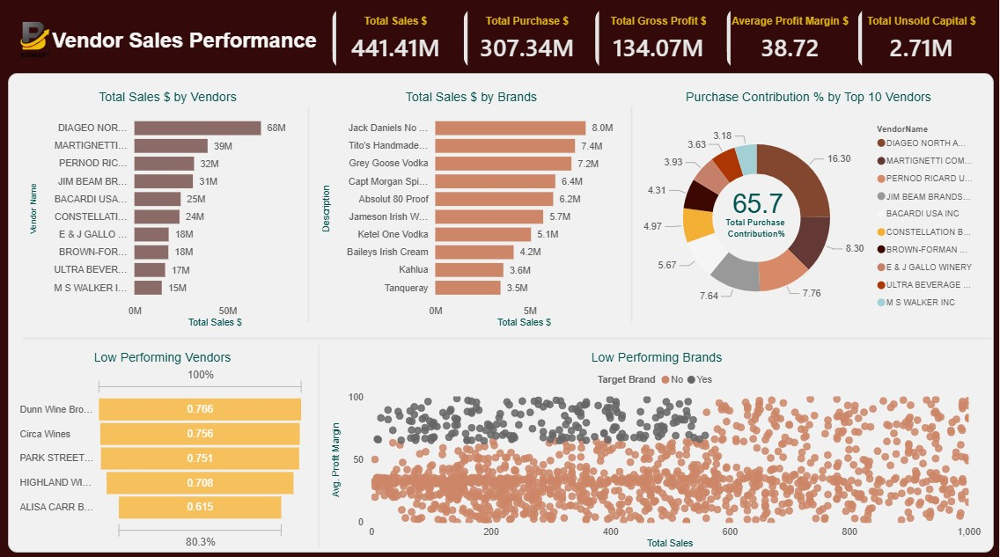

🎯 Project Objective :The objective of this project is to optimize inventory and sales management for a retail and wholesale business by identifying actionable insights that improve profitability. 
This involves analyzing brand performance, vendor contributions, bulk purchasing strategies, inventory efficiency, and profitability variances to support data-driven decision-making.

📌 Key Points / Goals:
1. Identify Underperforming Brands:
   
  • Detect brands with low sales or profitability.
  • Recommend promotional or pricing strategies to boost sales without compromising margins.

3. Evaluate Vendor Performance:

  • Determine top vendors contributing to overall sales and gross profit.
  • Identify underperforming vendors and assess the need for improved partnerships or strategies.

5. Analyse Bulk Purchasing Impact:
  • Examine how bulk purchases affect unit costs and overall profitability.
  • Suggest optimal purchasing strategies to maximize cost efficiency.

6. Assess Inventory Turnover:
  • Measure inventory movement and holding costs.
  • Recommend actions to reduce slow-moving stock and improve inventory efficiency.

7. Investigate Profitability Variance:
  • Compare high-performing vs low-performing vendors in terms of profit margins.
  • Identify key factors driving profitability differences and suggest corrective actions.

🗂️ Downlaod Full Dataset:
 
[Download Data Files](https://drive.google.com/drive/folders/1erbLbZfkdrBo5fBNuPR1sFVMkdXnivg7)

🗄️ Final Table:

📈 Power BI Report:

[See Full Dashboard Here!](https://app.powerbi.com/view?r=eyJrIjoiNGIyNGYxYWMtMzJmZS00ZjY4LWFmYzktNzFlMjg3MGM3MTNhIiwidCI6ImRmODY3OWNkLWE4MGUtNDVkOC05OWFjLWM4M2VkN2ZmOTVhMCJ9)

🔧 Project Process- 
1. State and Understand the Business Problem: Clearly define the problem statement and objectives to guide the analysis.
2. Gather Required Data: Collect relevant datasets including sales, inventory, and vendor information.
3. Integrate Python with MySQL: Establish connection between Python and MySQL for data manipulation and ingestion.
4. Create Database in MySQL Using Python Script: Set up the necessary database structure for storing the data.
5. Ingest Data into Database: Load collected data into the MySQL database.
6. Use Bulk Import Method for Large Files: Efficiently handle large datasets by using bulk import techniques via CMD and efficiently load big datasets .
7. Explore All Tables: Understand the structure and content of each table.
8. Join Tables and Select Required Columns: Combine relevant tables to create a single, comprehensive resultant table for analysis.
9. Exploratory Data Analysis (EDA) on Resultant Table: Perform initial analysis to identify trends, patterns, and anomalies.
10. Data Cleaning: Handle missing values, duplicates, and inconsistencies to ensure data quality.
11. Add Computational Columns: Create new columns for metrics, ratios, or KPIs required for analysis.
12. Data Visualization: Generate charts, graphs, and plots to visually interpret data.
13. Find Insights for Business Problems: Extract actionable insights to address the business objectives.
14. Perform Various Statistical and Analytical Testing: Validate hypotheses, test assumptions, and measure significance.
15. Use Clean Dataset in Power BI: Load the processed dataset into Power BI for advanced analysis.
16. Add Measures, Calculated Columns, and KPIs: Enhance the dataset for meaningful visualizations and metrics.
17. Create Power BI Report: Build interactive dashboards and reports to present insights effectively to stakeholders.

🛠️ Tools used -

● Mysql : 
1. Table Creation & Dataset Import
2. Data Checkup
3. Data Cleanup
4. Ad-Hoc analysis

● Python :
1. Integration with mysql
2. Database creation
3. Carry out exploratory data analysis
4. Data visualization
5. Carry out various Testings

● Power BI :
1. Integrated with mysql
2. Import dataset
3. Data modeling
4. Dax 
5. Mesures creation
6. Report building

● Microsoft word
Created summary report to present insights in a concise way.

📊 Insights & Recommendations :
1.	Adjust pricing strategies for brands with low sales but high margins to increase sales volume while maintaining profitability.
2.	Expand and diversify supplier relationships to reduce overreliance on a few vendors and minimize supply chain vulnerabilities.
3.	Capitalize on bulk purchasing benefits to sustain competitive pricing and improve inventory management efficiency.
4.	Manage slow-moving inventory more effectively by optimizing purchase quantities, introducing clearance promotions, or refining storage practices.
5.	Strengthen marketing and distribution efforts for underperforming vendors to boost sales volumes without eroding profit margins.
6.	Implementing these actions will enable the company to drive sustainable profitability, lower risks, and improve overall operational performance.
7.	By adopting these recommendations, the company can enhance long-term profitability, reduce risks, and streamline its operations for greater efficiency.

