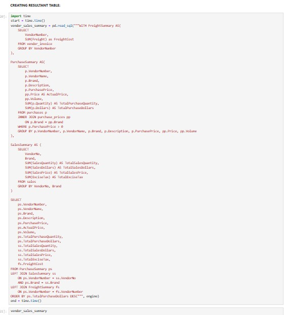
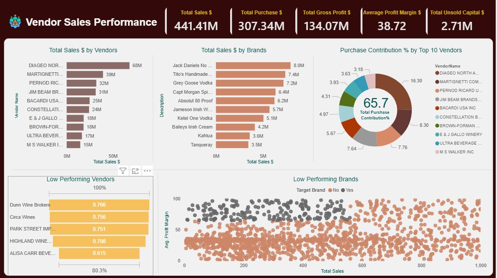

🎯 Project Objective :The objective of this project is to optimize inventory and sales management for a retail and wholesale business by identifying actionable insights that improve profitability. 
This involves analyzing brand performance, vendor contributions, bulk purchasing strategies, inventory efficiency, and profitability variances to support data-driven decision-making.

📌 Key Points / Goals:
1. Identify Underperforming Brands:
  • Detect brands with low sales or profitability.
  • Recommend promotional or pricing strategies to boost sales without compromising margins.

2. Evaluate Vendor Performance:
  • Determine top vendors contributing to overall sales and gross profit.
  • Identify underperforming vendors and assess the need for improved partnerships or strategies.

3. Analyse Bulk Purchasing Impact:
  • Examine how bulk purchases affect unit costs and overall profitability.
  • Suggest optimal purchasing strategies to maximize cost efficiency.

4. Assess Inventory Turnover:
  • Measure inventory movement and holding costs.
  • Recommend actions to reduce slow-moving stock and improve inventory efficiency.

5. Investigate Profitability Variance:
  • Compare high-performing vs low-performing vendors in terms of profit margins.
  • Identify key factors driving profitability differences and suggest corrective actions.

Final Table:

[See Full Dashboard Here!](https://app.powerbi.com/view?r=eyJrIjoiMjQ1MjEwMWUtYTRkZi00NWYxLTg1OTAtMzk0NjMyOGQ5MzE2IiwidCI6ImRmODY3OWNkLWE4MGUtNDVkOC05OWFjLWM4M2VkN2ZmOTVhMCJ9)
